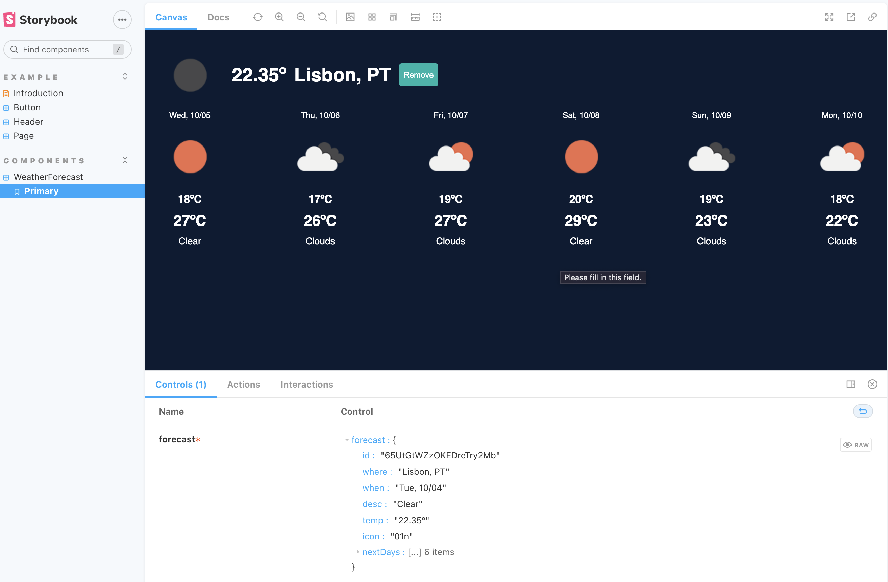
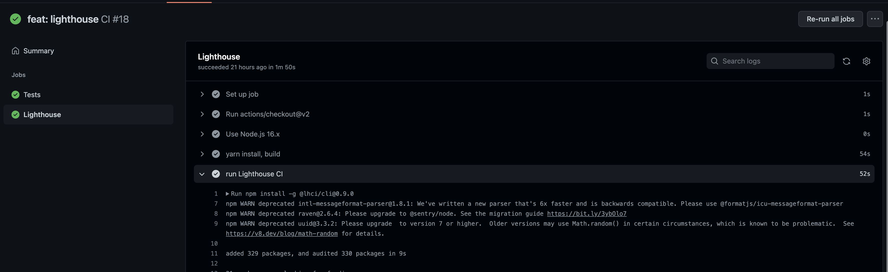
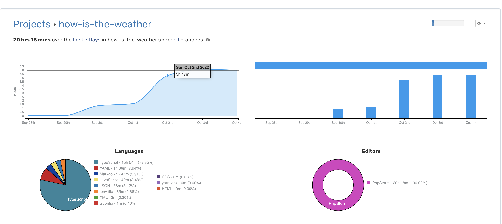

## Intro

All resources added in this project are initial concepts to highlight all NextJS frontend ecosystem.
Only few forecasts attributes were used for this test.

Live project -> [https://how-is-the-weather-utjt.vercel.app/](https://how-is-the-weather-utjt.vercel.app/)

## Getting Started

First, run the development server:

```bash
yarn install
#  and after that
yarn dev
```

Open [http://localhost:3000](http://localhost:3000) with your browser to see the result.


## E2E Tests

To run the tests locally:

```bash
yarn run dev
# and 
yarn run cypress
```

## Storybook

Storybook is a JavaScript tool that allows developers to create organized 
UI systems making both the building process and documentation more 
efficient and easier to use - [Reference here](https://www.freecodecamp.org/news/what-is-storybook-and-how-can-i-use-it-to-create-a-component-libary-in-react/)

A simple story was added as example using the WeatherForecast component. 
The idea is to add every new component here in order to track them.

```bash
yarn storybook
```

Open [http://localhost:6006/](http://localhost:6006/) with your browser to see the result.



### CI/CD

The Github Actions are defined as the CI/CD process.
_Cypress tests_ and the _[Lighthouse](https://github.com/GoogleChrome/lighthouse-ci) evaluation_ run every push in the main branch

*For the next project version, assertions can be defined for Lighthouse in order to avoid any Core Web Vitals regressions*



## TODOS
- [x] Get user location
- [x] Save locations on cookies
- [x] Get current weather
- [x] Create component to show the weather
- [x] Autocomplete google search
- [x] Get city weather
- [x] Create component to show the weather
- [x] Get weather by city
- [x] Save the users cities - cookies
- [x] Load cities after reload
- [x] Invalidate page after 60 minutes?
- [x] Add storybook
- [x] Add github cicd
- [x] Add lighthouse
- [x] Add cypress tests
- [ ] Add Docker

## Timesheet

The whole time spent in this project is related in the report bellow or in this [ink](https://wakatime.com/@ca63550e-cc01-4bb5-8f08-3b1c43419b28/projects/calxdoamwv?start=2022-09-28&end=2022-10-04)


